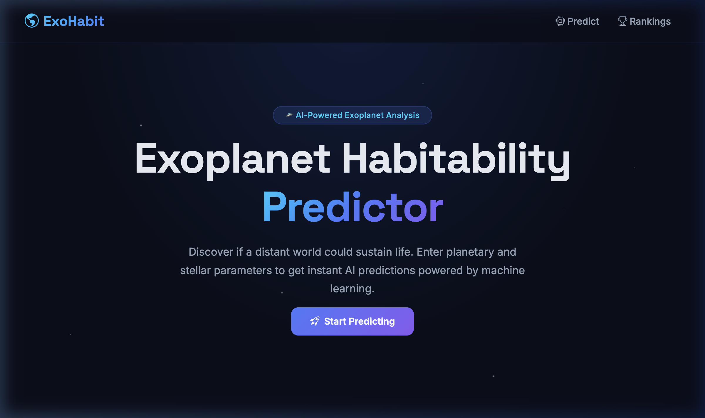
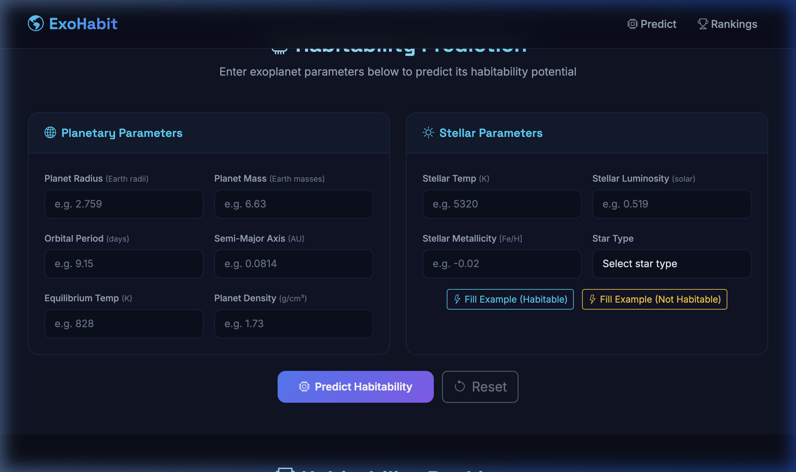
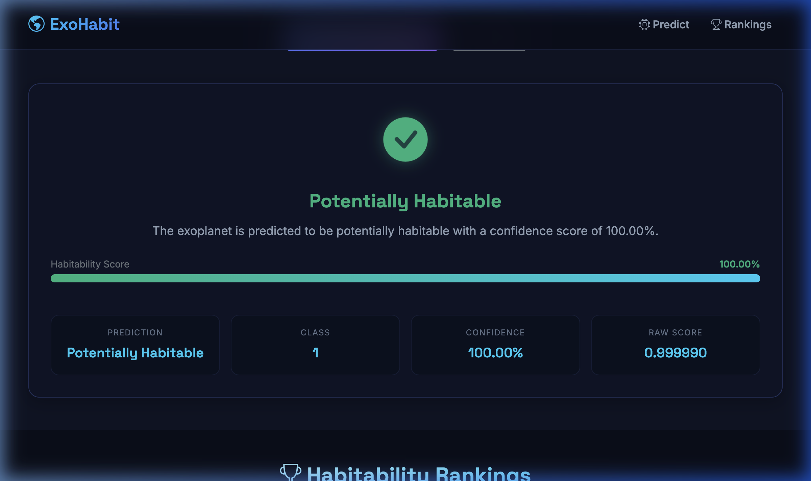
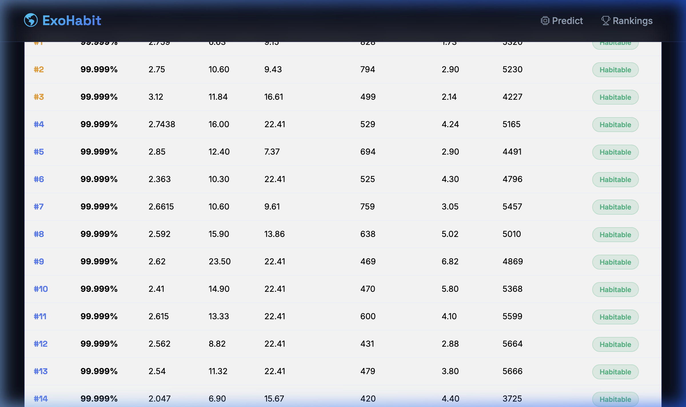

# Milestone-3: Backend API Integration & Frontend UI Development

## Infosys Springboard — Exoplanet Habitability Prediction

---

## Module 5: Backend API (Flask)

### 5.1 Objective

To expose the trained XGBoost machine learning model through a Flask-based REST API that accepts exoplanet parameters and returns habitability predictions with confidence scores.

### 5.2 Theory

#### REST API Architecture

REST (Representational State Transfer) is an architectural style for designing networked applications. Our API follows RESTful principles:

- **Stateless**: Each request contains all necessary information
- **Resource-based**: Endpoints represent resources (`/predict`, `/rank`)
- **HTTP Methods**: POST for predictions (data submission), GET for rankings (data retrieval)
- **JSON**: Standard data interchange format for request/response

#### Flask Framework

Flask is a lightweight Python web framework (micro-framework) ideal for building REST APIs:

- **Minimal boilerplate**: Simple application setup
- **Route decorators**: `@app.route()` maps URLs to functions
- **Request/Response handling**: Built-in JSON parsing and response generation
- **Extensible**: Supports middleware like Flask-CORS for cross-origin requests

#### Model Serving

The trained XGBoost model is serialized using `joblib` and loaded at application startup:

1. `joblib.load()` deserializes the `.pkl` file into an XGBClassifier object
2. The model remains in memory for fast inference
3. `model.predict()` returns the class prediction (0 or 1)
4. `model.predict_proba()` returns probability scores for confidence levels

#### Model Selection: XGBoost

From the two available models (Random Forest and XGBoost), **XGBoost was selected** because:

- **Size Efficiency**: 110 KB vs 772 KB (7x smaller)
- **Inference Speed**: Faster prediction times due to optimized gradient boosting
- **Accuracy**: XGBoost typically excels on structured/tabular data
- **Deployment**: Smaller model = easier deployment and faster loading

### 5.3 API Documentation

#### Base URL

```
http://127.0.0.1:5000
```

#### Endpoint 1: Health Check

```
GET /
```

Returns API status and available endpoints.

**Response:**
```json
{
    "status": "online",
    "api": "Exoplanet Habitability Prediction API",
    "version": "1.0",
    "endpoints": { ... },
    "required_features": [ ... ]
}
```

#### Endpoint 2: Predict Habitability

```
POST /predict
Content-Type: application/json
```

**Request Body** (14 parameters):

| Parameter | Type | Description | Example |
|-----------|------|-------------|---------|
| Planet_Radius | float | Planet radius (Earth radii) | 2.759 |
| Planet_Mass | float | Planet mass (Earth masses) | 6.63 |
| Orbital_Period | float | Orbital period (days) | 9.15 |
| Semi_Major_Axis | float | Semi-major axis (AU) | 0.0814 |
| Equilibrium_Temp | float | Equilibrium temperature (K) | 828 |
| Planet_Density | float | Planet density (g/cm³) | 1.73 |
| Stellar_Temp | float | Host star temperature (K) | 5320 |
| Stellar_Luminosity | float | Stellar luminosity (solar units) | 0.519 |
| Stellar_Metallicity | float | Stellar metallicity [Fe/H] | -0.02 |
| StarType_A | boolean | Star is type A | false |
| StarType_F | boolean | Star is type F | false |
| StarType_G | boolean | Star is type G | false |
| StarType_K | boolean | Star is type K | true |
| StarType_M | boolean | Star is type M | false |

**Example Request:**
```bash
curl -X POST http://127.0.0.1:5000/predict \
  -H "Content-Type: application/json" \
  -d '{
    "Planet_Radius": 2.759,
    "Planet_Mass": 6.63,
    "Orbital_Period": 9.15059,
    "Semi_Major_Axis": 0.0814,
    "Equilibrium_Temp": 828,
    "Planet_Density": 1.73,
    "Stellar_Temp": 5320,
    "Stellar_Luminosity": 0.519,
    "Stellar_Metallicity": -0.02,
    "StarType_A": false,
    "StarType_F": false,
    "StarType_G": false,
    "StarType_K": true,
    "StarType_M": false
  }'
```

**Success Response (200):**
```json
{
    "status": "success",
    "prediction": {
        "habitable": true,
        "class": 1,
        "label": "Potentially Habitable",
        "habitability_score": 0.99999,
        "confidence": "100.00%"
    },
    "message": "The exoplanet is predicted to be potentially habitable with a confidence score of 100.00%."
}
```

**Error Response (400):**
```json
{
    "status": "error",
    "message": "Missing required parameters: Planet_Mass, Orbital_Period, ...",
    "required_features": ["Planet_Radius", "Planet_Mass", ...]
}
```

#### Endpoint 3: Ranked Exoplanets

```
GET /rank
GET /rank?top_n=10
POST /rank  (body: {"top_n": 10})
```

Returns a ranked list of exoplanets based on habitability score.

**Success Response (200):**
```json
{
    "status": "success",
    "total_results": 101,
    "top_n": "all",
    "rankings": [
        {
            "rank": 1,
            "habitability_score": 0.99999046,
            "planet_radius": 2.759,
            "planet_mass": 6.63,
            "orbital_period": 9.1506,
            "equilibrium_temp": 827.8,
            "planet_density": 1.73,
            "stellar_temp": 5320.0,
            "predicted_class": 1
        }
    ],
    "message": "Returned 101 ranked exoplanets."
}
```

### 5.4 Input Validation

The API validates:
- **Missing parameters**: Returns list of missing required fields
- **Invalid types**: Checks numeric values are parsable as float
- **Star type constraints**: Exactly one StarType must be true
- **Content-Type**: Requires `application/json` header

### 5.5 Backend File Structure

```
backend/
├── app.py          # Flask application, routes, model loading
└── utils.py        # Validation, feature preparation, response formatting
```

### 5.6 Libraries Used

| Library | Version | Purpose |
|---------|---------|---------|
| Flask | 3.1.x | Web framework for REST API |
| Flask-CORS | 6.0.x | Cross-Origin Resource Sharing |
| joblib | 1.5.x | Model serialization/deserialization |
| numpy | latest | Numerical operations |
| pandas | 3.0.x | Data manipulation |
| scikit-learn | 1.8.x | ML utilities |
| xgboost | latest | XGBoost model support |

---

## Module 6: Frontend UI Development

### 6.1 Objective

To build a user-friendly web interface that allows users to input exoplanet data and view habitability predictions powered by the ML model through the Flask backend.

### 6.2 Theory

#### Client-Server Architecture

The frontend communicates with the backend using the Fetch API:

1. User enters exoplanet parameters in the HTML form
2. JavaScript validates inputs on the client side
3. Data is serialized to JSON and sent via HTTP POST to `/predict`
4. Backend processes the request through the ML model
5. JSON response is parsed and dynamically rendered in the UI

#### Technologies Used

| Technology | Purpose |
|------------|---------|
| HTML5 | Semantic page structure |
| CSS3 | Custom styling with glassmorphism and animations |
| Bootstrap 5 | Responsive grid layout and components |
| JavaScript (ES6+) | Fetch API calls, DOM manipulation, validation |
| Google Fonts | Inter and Space Grotesk typography |
| Bootstrap Icons | UI iconography |

#### Design Principles

- **Dark Space Theme**: Immersive design appropriate for astronomical data
- **Glassmorphism**: Frosted glass card effects using `backdrop-filter`
- **Responsiveness**: Bootstrap grid ensures mobile-friendly layout
- **Accessibility**: Proper labels, placeholders, ARIA attributes
- **Micro-animations**: Score bar animation, pulse effects, slide transitions

### 6.3 UI Components

1. **Navigation Bar**: Fixed-top with links to Predict and Rankings sections
2. **Hero Section**: Landing area with call-to-action button
3. **Prediction Form**: Two-column layout (Planetary + Stellar parameters)
4. **Quick Fill Buttons**: Pre-fill form with habitable/not-habitable examples
5. **Result Card**: Dynamic display with icon, label, score bar, and detail grid
6. **Rankings Table**: Sortable table with pagination control (top N selector)
7. **Error Alerts**: Styled error messages for invalid inputs or connection issues
8. **Loading States**: Spinner animations during API calls

### 6.4 Frontend File Structure

```
frontend/
├── index.html      # Page structure and layout
├── style.css       # Custom CSS with space theme
└── script.js       # API calls, validation, dynamic rendering
```

### 6.5 Client-Side Validation

- All 9 numeric fields must be filled with valid numbers
- Star type dropdown must have a selection
- Visual feedback with red borders on invalid fields
- Error alert displayed at the bottom of the form

### 6.6 API Integration

```javascript
// Prediction request
const response = await fetch('http://127.0.0.1:5000/predict', {
    method: 'POST',
    headers: { 'Content-Type': 'application/json' },
    body: JSON.stringify(payload)
});

// Rankings request
const response = await fetch('http://127.0.0.1:5000/rank?top_n=10');
```

### 6.7 Error Handling

- **Connection errors**: User-friendly message if backend is unreachable
- **Validation errors**: Backend error messages displayed in alert
- **Loading states**: Spinner shown during API calls, button disabled
- **No page reloads**: All submissions handled via JavaScript `preventDefault()`

---

## Screenshots

### 1. Hero / Landing Page


### 2. Prediction Form (Filled)


### 3. Prediction Result — Potentially Habitable


### 4. Habitability Rankings Table


---

## How to Run

### Start Backend
```bash
cd backend/
python app.py
```
Server starts at `http://127.0.0.1:5000`

### Open Frontend
Open `frontend/index.html` in any web browser.

### Test with curl
```bash
# Health check
curl http://127.0.0.1:5000/

# Predict
curl -X POST http://127.0.0.1:5000/predict \
  -H "Content-Type: application/json" \
  -d '{"Planet_Radius":2.759,...}'

# Rankings
curl 'http://127.0.0.1:5000/rank?top_n=10'
```

---

*Infosys Springboard Project — Exoplanet Habitability Prediction System*
